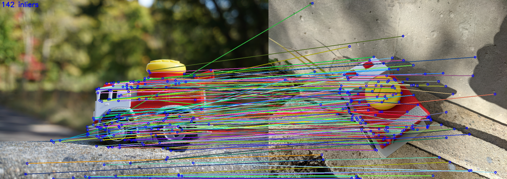

<div align="center">

# \[CVPR'24\] Code release for OmniGlue

<p align="center">
    <a href="https://hwjiang1510.github.io/">Hanwen Jiang</a>,
    <a href="https://scholar.google.com/citations?user=jgSItF4AAAAJ">Arjun Karpur</a>,
    <a href="https://scholar.google.com/citations?user=7EeSOcgAAAAJ">Bingyi Cao</a>,
    <a href="https://www.cs.utexas.edu/~huangqx/">Qixing Huang</a>,
    <a href="https://andrefaraujo.github.io/">Andre Araujo</a>
</p>

</div>

--------------------------------------------------------------------------------

<div align="center">
    <a href="https://hwjiang1510.github.io/OmniGlue/"><strong>Project Page</strong></a> |
    <a href="https://arxiv.org/abs/2405.12979"><strong>Paper</strong></a> |
    <a href="#installation"><strong>Usage</strong></a> |
    <a href="https://huggingface.co/spaces/qubvel-hf/omniglue"><strong>Demo</strong></a>
</div>

<br>

<div align="center">

[](https://huggingface.co/spaces/qubvel-hf/omniglue)

</div>

<br>

Official code release for the CVPR 2024 paper: **OmniGlue: Generalizable Feature
Matching with Foundation Model Guidance**.


**Abstract:** The image matching field has been witnessing a continuous
emergence of novel learnable feature matching techniques, with ever-improving
performance on conventional benchmarks. However, our investigation shows that
despite these gains, their potential for real-world applications is restricted
by their limited generalization capabilities to novel image domains. In this
paper, we introduce OmniGlue, the first learnable image matcher that is designed
with generalization as a core principle. OmniGlue leverages broad knowledge from
a vision foundation model to guide the feature matching process, boosting
generalization to domains not seen at training time. Additionally, we propose a
novel keypoint position-guided attention mechanism which disentangles spatial
and appearance information, leading to enhanced matching descriptors. We perform
comprehensive experiments on a suite of 6 datasets with varied image domains,
including scene-level, object-centric and aerial images. OmniGlue’s novel
components lead to relative gains on unseen domains of 18.8% with respect to a
directly comparable reference model, while also outperforming the recent
LightGlue method by 10.1% relatively.


## Installation

First, use pip to install `omniglue`:

```sh
conda create -n omniglue pip
conda activate omniglue

git clone https://github.com/google-research/omniglue.git
cd omniglue
pip install -e .
```

Then, download the following models to `./models/`

```sh
# Download to ./models/ dir.
mkdir models
cd models

# SuperPoint.
git clone https://github.com/rpautrat/SuperPoint.git
mv SuperPoint/pretrained_models/sp_v6.tgz . && rm -rf SuperPoint
tar zxvf sp_v6.tgz && rm sp_v6.tgz

# DINOv2 - vit-b14.
wget https://dl.fbaipublicfiles.com/dinov2/dinov2_vitb14/dinov2_vitb14_pretrain.pth

# OmniGlue.
wget https://storage.googleapis.com/omniglue/og_export.zip
unzip og_export.zip && rm og_export.zip
```

Direct download links:

-   [[SuperPoint weights]](https://github.com/rpautrat/SuperPoint/tree/master/pretrained_models): from [github.com/rpautrat/SuperPoint](https://github.com/rpautrat/SuperPoint)
-   [[DINOv2 weights]](https://dl.fbaipublicfiles.com/dinov2/dinov2_vitb14/dinov2_vitb14_pretrain.pth): from [github.com/facebookresearch/dinov2](https://github.com/facebookresearch/dinov2) (ViT-B/14 distilled backbone without register).
-   [[OmniGlue weights]](https://storage.googleapis.com/omniglue/og_export.zip)

## Usage
The code snippet below outlines how you can perform OmniGlue inference in your
own python codebase.

```py

import omniglue

image0 = ... # load images from file into np.array
image1 = ...

og = omniglue.OmniGlue(
  og_export='./models/og_export',
  sp_export='./models/sp_v6',
  dino_export='./models/dinov2_vitb14_pretrain.pth',
)

match_kp0s, match_kp1s, match_confidences = og.FindMatches(image0, image1)
# Output:
#   match_kp0: (N, 2) array of (x,y) coordinates in image0.
#   match_kp1: (N, 2) array of (x,y) coordinates in image1.
#   match_confidences: N-dim array of each of the N match confidence scores.
```

## Demo

`demo.py` contains example usage of the `omniglue` module. To try with your own
images, replace `./res/demo1.jpg` and `./res/demo2.jpg` with your own
filepaths.

```sh
conda activate omniglue
python demo.py ./res/demo1.jpg ./res/demo2.jpg
# <see output in './demo_output.png'>
```

Expected output:



## Repo TODOs

- ~~Provide `demo.py` example usage script.~~
- ~~Add to image matching webui~~ (credit: [@Vincentqyw](https://github.com/Vincentqyw))
- Support matching for pre-extracted features.
- Release eval pipelines for in-domain (MegaDepth).
- Release eval pipelines for all out-of-domain datasets.

## BibTex
```
@inproceedings{jiang2024Omniglue,
   title={OmniGlue: Generalizable Feature Matching with Foundation Model Guidance},
   author={Jiang, Hanwen and Karpur, Arjun and Cao, Bingyi and Huang, Qixing and Araujo, Andre},
   booktitle={Proceedings of the IEEE/CVF Conference on Computer Vision and Pattern Recognition (CVPR)},
   year={2024},
}
```

--------------------------------------------------------------------------------

This is not an officially supported Google product.
